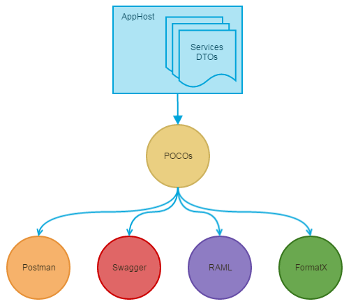
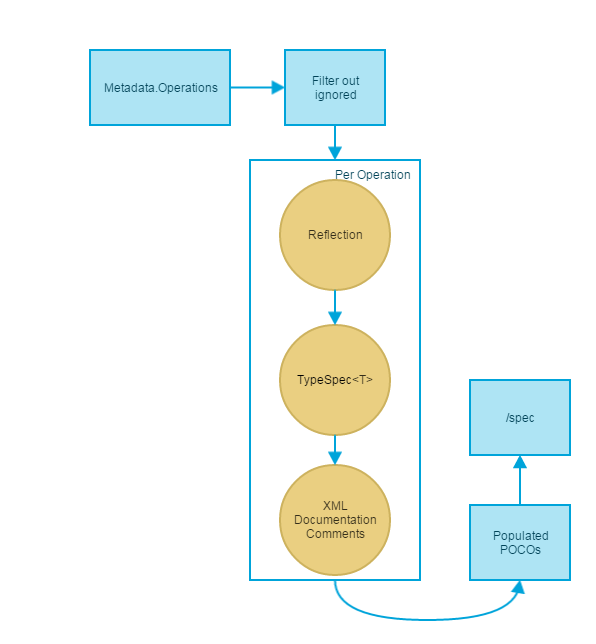

#  ServiceStack.IntroSpec
[](https://ci.appveyor.com/project/wwwlicious/servicestack-introspec/branch/master)
[](https://badge.fury.io/nu/ServiceStack.IntroSpec)

A plugin for [ServiceStack](https://servicestack.net/) that generates a series of POCOs documenting all available services as well as request and response DTOs. These POCOs will allow the data to be be visualised in a number of standard API documentation formats (e.g. postman, swagger, RAML).

---



The plugin uses introspection on a number of different sources to generate as rich a set of documentation possible.

## Quick Start

Install the package [https://www.nuget.org/packages/ServiceStack.IntroSpec](https://www.nuget.org/packages/ServiceStack.IntroSpec/)
```bash
PM> Install-Package ServiceStack.IntroSpec
```

The plugin is added like any other. It has a dependency [Metadata Plugin](https://github.com/ServiceStack/ServiceStack/wiki/Metadata-page) and by default requires that `AppHost.Config.WebHostUrl` is set. It also takes a delegate to create an instance of `ApiSpecConfig` as a constructor argument, as a minimum this must be populated with `Contact.Email`, `Contact.Name` and `Description`. There is a fluent interface which aids in the creation of the`ApiSpecConfig` object.
```csharp
public override void Configure(Container container)
{
    SetConfig(new HostConfig
    {
        // Required to know base URL
        WebHostUrl = "http://api.example.com:8001",
    });

	// Register plugin
    Plugins.Add(new ApiSpecFeature(config =>
        config.WithDescription("This is a demo app host for testing.")
              .WithLicenseUrl(new Uri("http://mozilla.org/MPL/2.0/"))
              .WithContactName("Joe Bloggs")
              .WithContactEmail("email@address.com")));
}
```

There is a `DocumenterSettings` class that can be used to configure certain behaviours and provide fallback values. See [Settings](docs/settings.md) for details of options.

When the service starts up this will generate a list of all documentation.

## Documenting DTOs
The plugin uses the `Metadata Plugin` as the seed for all operations then uses a series of 'enrichers' to generate documentation, these are called in the order listed below. The general approach is to use Reflection to get as much information as possible which can then be augmented (with descriptions, notes etc) from further sources.

### Enrichment


For full details of the sources of data for the various enrichers please see [Sources](docs/sources.md)

### ReflectionEnricher
The `ReflectionEnricher` uses reflection to generate documentation. This is the best source of information as it uses many of the same mechanisms as ServiceStack to determine information.

For example the following class would look at a combination of `[Api]`, `[ApiResponse]`, `[Route]`, `[ApiMember]`, `[IgnoreDataMember]` and `[ApiAllowableValues]` attributes to generate the documentation.

```csharp
[Api("Demo Request Description")]
[ApiResponse(HttpStatusCode.OK, "Everything is hunky dory")]
[ApiResponse(HttpStatusCode.InternalServerError, "Something went wrong")]
[Route("/request/{Name}", "GET,POST", Summary = "Route summary", Notes = "Notes about request")]
public class DemoRequest : IReturn<DemoResponse>
{
    [ApiMember(Name = "Name parameter", Description = "This is a description of name", ParameterType = "body", DataType = "string", IsRequired = true)]
    [ApiAllowableValues("Name", typeof(NameEnum))]
    public string Name { get; set; }

    [IgnoreDataMember]
    public string Ignored { get; set; }

    [ApiMember(ExcludeInSchema = true)]
    public int Optional { get; set; }
}

[Api("Demo Response Description")]
public class DemoResponse
{
	[ApiMember(Name="Response Message", Description = "The returned message")]
	public string Message { get; set; }
}
```
This approach uses a combination of attributes, DTO and service types and implemented interfaces to generate a good description of a service.

### AbstractClassEnricher
This uses an approach similar to [FluentValidation](https://github.com/ServiceStack/ServiceStack/wiki/Validation#fluentvalidation-for-request-dtos) to provide additional information about objects.

The enricher scans for implementations of `AbstractRequestSpec<T>` (for Request DTOs) `AbstractTypeSpec<T>` (any other classes to be documented, e.g. embedded classes or Response DTOs) and generates documentation based on this. E.g.

```csharp
public class DemoRequestSpec : AbstractRequestSpec<DemoRequest>
{
    public DemoRequestAbstract()
    {
        Title = "Plain request title from abstract";
        Description = "Demo Request Description";
        Notes = "Notes about demo request";

        Category = "Category1";

        AddTags("Tag1", "Tag2", "Tag3");

        AddStatusCodes(HttpVerbs.Post,
            new StatusCode
            {
                Code = 500,
                Name = "Internal Server Error",
                Description = "Something went wrong"
            },
            (StatusCode)HttpStatusCode.OK);

		AddContentTypes(HttpVerbs.Get, "application/x-custom-type");

        For(t => t.Name)
            .With(p => p.Title, "Name parameter")
            .With(p => p.IsRequired, true)
            .With(p => p.Description, "This is a description of name.");

        For(t => t.Age)
            .With(p => p.Title, "This is optional.")
            .With(p => p.IsRequired, false);
    }
}

public class DemoResponseSpec : AbstractTypeSpec<DemoResponse>
{
    public DemoResponseSpec()
    {
        Title = "Demo response title from documenter";
        Description = "Demo Response Description";
		
		For(t => t.Message)
			.With(p => p.Title, "Response Message")
            .With(p => p.Description, "The message returned from service.");
    }
}
```
This approach allows for very explicit setting of properties. Whilst they will have no effect to the processing of requests it provides the ability to generate rich documentation about DTOs.
### XmlEnricher
This uses the standard [C# Xml Documentation Comments](https://msdn.microsoft.com/en-us/library/b2s063f7(v=vs.140).aspx) to generate documentation. 

```csharp
/// <summary>
/// Demo Request Description
/// </summary>
/// <remarks>Notes about request</remarks>
public class DemoRequest : IReturn<DemoResponse>
{
	/// <summary>Name parameter</summary>
	/// <remarks>This is a description of name</remarks>
    public string Name { get; set; }

    public string Ignored { get; set; }

    /// <summary>Age Parameter</summary>
    public int Age{ get; set; }
}

/// <summary>
/// Demo Response Description
/// </summary>
public class DemoResponse
{
	/// <summary>Response Message</summary>
	/// <remarks>The returned message</remarks>
	public string Message { get; set; }
}
```

The XML documentation comments are for general documentation about classes and not specifically for documentating APIs and DTOs but if need be these values can be used.

__Note:__ for this to work the XML documentation file must be generated for the service. To do so RMC project -> Properties -> Build -> check "XML documentation file" box.

### FallbackEnricher
This will use global settings within the `DocumenterSetting` object for setting both fallback values (e.g. `.FallbackNotes` for if no other `Notes` are found) or default values (e.g. `.DefaultTags` which are combined with tags from other sources).
```csharp
DocumenterSettings.FallbackNotes = "Default notes";
DocumenterSettings.FallbackCategory = "Fallback Category";
DocumenterSettings.DefaultTags = new[] { "DefaultTag" };
DocumenterSettings.DefaultStatusCodes = new List<StatusCode>
{
   ((StatusCode)429).WithDescription("This is rate limited"),
};
Plugins.Add(new ApiSpecFeature(apiSpecConfig));
```
The `.With()` method can be used to set multiple values:
```csharp
DocumenterSettings.With(fallbackNotes: "Default notes",
    fallbackCategory: "Fallback Category", 
    defaultTags: new[] { "DefaultTag" },
    defaultStatusCodes: new List<StatusCode>{
        ((StatusCode) 429).WithDescription("This is rate limited")
    });
Plugins.Add(new ApiSpecFeature(apiSpecConfig));
```

## Customising
The plugin filters the `Metadata.OperationsMap` to get a list of `Operation` objects that contain the requests to be documented. This filter can be customised by providing a predicate to the plugin using the `ApiSpecFeature.WithOperationsFilter()` method. The default filter excludes any types that have `[Exclude(Feature.Metadata]` or `[Exclude(Feature.ServiceDiscovery]` or any restrictions.


## Output
3 services are registered as part of this service

### Spec

The plugin will also register a service which can be accessed at [`/spec`](http://introspec.servicestack.net/spec?format=json) to view the raw generated documentation POCOs.

This endpoint can optionally be filtered by `?requestDto`, `?tag` and/or `?category`.

Example output is:
```json
{
  "ApiDocumentation": {
    "Title": "DemoDocumentationService",
    "ApiVersion": "2.0",
    "ApiBaseUrl": "http://127.0.0.1:8090/",
    "Description": "This is a demo app host setup for testing documentation.",
    "LicenceUrl": "http://mozilla.org/MPL/2.0/",
    "Contact": {
      "Name": "Joe Bloggs",
      "Email": "email@address.com"
    },
    "Resources": [
      {
        "TypeName": "FallbackRequest",
        "Title": "Fallback request title",
        "Description": "Fallback request desc",
        "Properties": [
          {
            "Id": "Name",
            "ClrType": "System.String, mscorlib",
            "Title": "Name parameter abstract class definition",
            "IsRequired": true
          },
          {
            "Id": "Age",
            "ClrType": "System.Int32, mscorlib",
            "Title": "Age is optional",
            "IsRequired": false,
            "Contraints": {
              "Name": "Age Range",
              "Min": 0,
              "Max": 120,
              "Type": "Range"
            }
          }
        ],
        "Actions": [
          {
            "Verb": "GET",
            "Notes": "This is a note about GET route",
            "StatusCodes": [
              {
                "Code": 429,
                "Description": "This is rate limited",
                "Name": "Too Many Requests"
              },
              {
                "Code": 200,
                "Name": "OK"
              }
            ],
            "ContentTypes": [
              "application/xml",
              "application/json"
            ],
            "RelativePaths": [
              "/fallback"
            ]
          }
        ],
        "ReturnType": {
          "Title": "ComplexResponse"
          "Properties": [
            {
              "Id": "Message",
              "ClrType": "System.String, mscorlib",
              "Title": "Message",
              "Description": "The returned message"
            }
          ]
        },
        "Category": "Category1",
        "Tags": [
          "Tag1",
          "DefaultTag"
        ]
      }
    ]
  }
}
```
### Spec Metadata
The plugin will also register a service which can be accessed at [`/spec/summary`](http://introspec.servicestack.net/spec/summary?format=json) to view the raw generated documentation POCOs. This will return some metadata about the documentation.

The values that are returned are the 3 fields that can be used to filter the other 2 services: Request DTO Name, Tags and Category. E.g.

```json
{
  "DtoNames": [
    "DemoRequest",
    "FallbackRequest",
    "EmptyDtoRequest",
    "OneWayRequest",
    "SecureRequest"
  ],
  "Categories": [
    "Fallback Category",
    "Category1"
  ],
  "Tags": [
    "DefaultTag",
    "Tag1",
    "Tag2",
    "Tag3"
  ]
}
```
In future this will be used to power a separate application that can aggregate documentation from multiple different services.

### Postman
The 3rd service that is registered can be found at [`/spec/postman`](http://introspec.servicestack.net/spec/postman) and generates JSON that can be consumed by the Postman REST client.

Although there is an existing [Postman Plugin](https://github.com/ServiceStack/ServiceStack/wiki/Postman) for ServiceStack which does the same thing, Postman was the easiest format to output the specification information as.

This endpoint can optionally be filtered by `?requestDto`, `?tag` and/or `?category`.

### Restrictions
The plugin currently does not respect `AuthenticateAttribute`, it will document them but not restrict visibility or access.